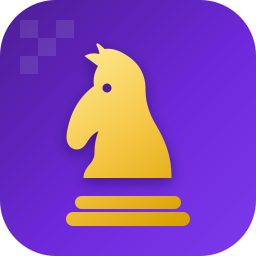

<div align="center">



# ♟️ ChessMaster

**Learn chess online and offline — your way to become a King.**

A B2C mobile app: live Olympiad games, an end-to-end self-learn curriculum, a
game analyzer for *your* games, and a coach that preps you for tournaments.

</div>

---

## What's in this repo (v0 scaffold)

A cross-platform mobile app built with **Expo + React Native + TypeScript**.
The design follows a clean, classic light theme (white surfaces, black actions,
gold accents, bold colorful feature cards).

**Free to use during launch** — all features unlocked; paid plans come later.

### Screens

| Area | Screens |
|---|---|
| **Onboarding** | Welcome / splash, Sign Up ("Become a Chess Member"), Sign In |
| **Class** | Live Class · Upcoming Class (language schedules) · All Class (levels + self-learn curriculum) |
| **Olympiad Live** | Live game player with board, engine eval, move list & playback controls |
| **Puzzle** | Assigned puzzles list + puzzle solver ("Your Turn") |
| **Game** | Play tournaments / friends / computer, chess clock, + Analyzer & Prep Coach |
| **Analyze** | Import from Chess.com / Lichess / PGN → findings & recurring mistakes |
| **Coach** | Tournament-prep plan & repertoire coaching |
| **Plans** | Membership tiers (preview — free during launch) |
| **Shop** | Boards, pieces, clocks, T-shirts |
| **Profile** | Rating, streak, settings |

### Project structure

```
App.tsx                     App root + navigation container
src/
  theme/           Design tokens (colors, spacing, typography)
  components/       Logo, ChessBoard, AppHeader, UI kit (Button, Card, Input…)
  data/            content.ts — placeholder content (swap for backend later)
  navigation/      RootNavigator (auth stack + bottom tabs + detail screens)
  screens/         All app screens
assets/            Logo + generated app icons / splash
PRODUCT.md         Product vision & roadmap
```

## Run it

```bash
npm install
npm start          # then press i (iOS), a (Android), or w (web)
# or:
npm run ios
npm run android
npm run web
```

Requires [Node 18+](https://nodejs.org) and the
[Expo Go](https://expo.dev/go) app on your phone (or a simulator).

```bash
npm run typecheck  # tsc --noEmit
```

## Roadmap

- **v0 (this repo):** full screen scaffold, navigation, design system, logo.
- **v1:** real accounts, live-game feed, on-device Stockfish analysis, backend.
- **v1.x:** deeper analyzer, repertoire trainer, notifications, social.

See [PRODUCT.md](./PRODUCT.md) for the full vision.

> Placeholder players, games, and prices are illustrative only.
